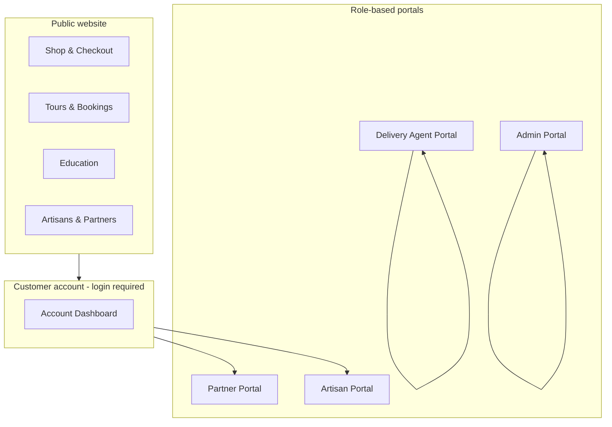

# Agri-Eco — User & Portal Navigation Guide

**Purpose:** Help visitors, customers, partners, staff, and reviewers explore the Agri-Eco platform confidently.  
**Audience:** Non-technical users, demo reviewers, and stakeholders.  
**Live site (example):** [https://agri-eco-three.vercel.app](https://agri-eco-three.vercel.app)

---

## At a glance

Agri-Eco is an all-in-one platform for:

| Area | What you can do |
|------|-----------------|
| **Shop** | Browse products, add to cart, checkout, track orders, request returns |
| **Tours & stays** | Discover experiences, book tours, pay online |
| **Education** | Enroll in training programs, earn certificates, request school visits |
| **Community** | Meet artisans and partners, view profiles and products |
| **Account** | Manage profile, orders, bookings, enrollments, addresses, and requests |
| **Special portals** | Partner, Artisan, Delivery Agent, and Admin workspaces |

The app supports **English, Kinyarwanda, French, and Kiswahili** (language switcher in the site header).

---

## How to get started

### Create an account

1. Open **Register** (`/register`).
2. Fill in username, email, phone, password, and location.
3. Accept the terms, then submit.
4. Go to **Login** (`/login`) and sign in with your email and password.

### Sign in

- **Login page:** `/login`
- **Forgot password:** `/forgot-password`
- **Reset password:** `/reset-password` (from email link)

After login, click the **person icon** (top right) to open your account menu. From there you can reach:

- My Account
- Admin Dashboard *(if you are staff)*
- Partner Portal *(if approved partner)*
- Artisan Portal *(if approved artisan)*
- Delivery Portal *(if delivery agent)*

### Team invite (staff)

If an administrator invites you to the team, open the link they send (e.g. `/accept-invite?token=…`), set your password, and accept the invite. You will then be able to access the **Admin** area with the role assigned to you.

---

## Main website navigation

### Top menu (header)

| Menu item | Page | Login required? |
|-----------|------|-----------------|
| Home | `/` | No |
| Shop | `/shop` | No |
| Tours | `/tours` | No |
| Beekeeping | `/beekeeping` | No |
| Education | `/education` | No |
| Blog | `/blog` | No |
| Community | `/artisans` | No |
| Partners | `/partners` | No |
| About | `/about` | No |
| Deals | `/deals` | No |

### Quick actions in the header

| Icon / action | Where it goes | Notes |
|---------------|---------------|-------|
| Search | Shop, Tours, or Education | Choose scope, type keywords, press Enter |
| Wishlist | `/wishlist` | Saved products *(when shopping is enabled)* |
| Cart | `/cart` | Review items before checkout |
| User menu | Account & portals | Appears after login |
| Language | EN / RW / FR / SW | Changes site language |

### Footer links

Common links include **Contact** (`/contact`), **Feedback** (`/feedback`), **Privacy Policy** (`/privacy-policy`), **Terms of Service** (`/terms-of-service`), **Gallery** (`/gallery`), and **Newsletter signup**.

---

## Public areas (no login needed)

### Home (`/`)

The homepage highlights:

- Featured tours and beekeeping
- Best-selling shop products
- Education programs preview
- Artisan showcase
- Testimonials and promotions

Sections shown depend on which features are turned on (see **Feature availability** below).

---

### Shop

| Page | URL | What to do |
|------|-----|------------|
| Shop catalog | `/shop` | Browse, filter, and search products |
| Product details | `/product/[slug]` | View price, description, add to cart or wishlist |
| Deals | `/deals` | View discounted or promotional items |
| Cart | `/cart` | Change quantities, proceed to checkout |
| Wishlist | `/wishlist` | View saved products |
| Delivery areas | `/delivery-areas` | See where the shop delivers *(also linked from checkout)* |
| Delivery info | `/delivery` | General delivery information |

**Typical shopping flow**

```
Shop → Product → Add to cart → Cart → Checkout → Order confirmation
```

---

### Checkout (`/checkout`)

**Important:** You must be **logged in** to place an order and pay.

1. Enter shipping details (name, phone, address, city, etc.).
2. Check the **delivery area** banner — confirm your address is in a supported zone (`/delivery-areas`).
3. Optionally apply a **discount code**.
4. Choose payment:
   - **Mobile Money (MTN or Airtel)** — enter MoMo number; approve payment on your phone when prompted.
   - **Cash on Delivery (COD)** — pay when the order arrives.
5. Place order — you are redirected to your order details when done.

If Mobile Money fails, the order may still be created as **pending payment**. Check **My Orders** in your account and retry payment or contact support.

---

### Tours & travel

| Page | URL | What to do |
|------|-----|------------|
| Tours list | `/tours` | Browse available experiences |
| Tour details | `/tours/[slug]` | View itinerary, pricing, book a date |
| Beekeeping | `/beekeeping` | Dedicated beekeeping experiences |
| Accommodations | Linked from tour content | Stay options where available |

**Booking flow**

1. Open a tour page.
2. Select date, guests, and options.
3. Sign in if prompted.
4. Pay with **Mobile Money** (MTN/Airtel) or join a **waitlist** if the tour is full.
5. View bookings under **Account → My Tours** (`/account/bookings`).

---

### Education & training

| Page | URL | What to do |
|------|-----|------------|
| Programs list | `/education` | Browse training programs |
| Program details | `/education/program/[slug]` | View modules, enroll, pay if required |
| School visit request | `/education/school-visit` | Schools can request a visit |
| Validate certificate | `/certificates/validate` | Anyone can verify a certificate number or QR code |

**Enrollment flow**

1. Open a program.
2. Enroll (login required).
3. Pay with Mobile Money if the program is paid; free programs skip payment.
4. Track progress under **Account → My Enrollments** (`/account/enrollments`).
5. Download or view certificates under **Account → My Certificates** (`/account/certificates`) after completion.

---

### Community & partners

| Page | URL | What to do |
|------|-----|------------|
| Artisans | `/artisans` | Browse artisan profiles and products |
| Artisan profile | `/artisan/[id]` or `/community/artisan/[id]` | View story, location, and products |
| Community hub | `/community` | Broader community page with applications |
| Partners directory | `/partners` | View partner organizations |
| Partner profile | `/partners/[partnerId]` | Public partner details |

From the community area, logged-in users can **apply to become an artisan** or **partner** (applications are reviewed by admin).

---

### Content & support

| Page | URL | Purpose |
|------|-----|---------|
| Blog | `/blog` | News and articles |
| Blog post | `/blog/[id]` | Read a single article |
| About | `/about` | About Agri-Eco |
| Gallery | `/gallery` | Photo gallery |
| Contact | `/contact` | Send a message to the team |
| Feedback | `/feedback` | Share feedback about the platform |

---

## Customer account portal

**URL prefix:** `/account`  
**Access:** Login required (any registered customer)

Open via **User menu → My Account** or go directly to `/account`.

### Account menu

| Section | URL | What you can do |
|---------|-----|-----------------|
| Dashboard | `/account` | Overview: orders, cart, enrollments, bookings, quick links |
| My Profile | `/account/profile` | Update personal information |
| My Orders | `/account/orders` | List and search orders |
| Order details | `/account/orders/[orderId]` | Track status, view QR code, **request a return** |
| My Tours | `/account/bookings` | View tour bookings and payment status |
| Partner Network | `/account/partner` | Partner dashboard *(approved partners only)* |
| My Enrollments | `/account/enrollments` | Training progress and status |
| My Certificates | `/account/certificates` | Earned certificates |
| My Requests | `/account/requests` | Track partner/artisan/school visit applications |
| Returns & Appeals | `/account/returns` | List return requests |
| Return details | `/account/returns/[returnId]` | View items, status, submit or cancel appeals |
| Artisan Portal | `/account/artisan` | Artisan dashboard *(approved artisans)* |
| Saved Addresses | `/account/addresses` | Manage delivery addresses |
| Account Settings | `/account/settings` | Password and preferences |

### Returns (customers)

1. Go to **My Orders** → open an order.
2. Click **Request return** (within the allowed return window).
3. Select products, quantities, reasons, and optional photos.
4. Track the return under **Returns & Appeals**.
5. If rejected, you can **appeal** (up to 2 times) from the return detail page.

---

## Special portals overview



---

## Partner portal

| Item | Details |
|------|---------|
| **URL** | `/account/partner` |
| **Who can access** | Users with an **approved partner** role |
| **How to get access** | Apply at `/account/partner/apply` or via `/community` → admin reviews and approves |
| **Login** | Required |

**What partners can do**

- View partner profile and status
- See active and past **agreements**
- Open agreement details: `/account/partner/agreement/[agreementId]`
- Track **inputs** and **payments** per agreement
- Monitor earnings summary

**Application states:** Pending → Approved or Rejected (visible under **My Requests**).

---

## Artisan portal

| Item | Details |
|------|---------|
| **URL** | `/account/artisan` |
| **Who can access** | Users with an **approved artisan** (farmer/artisan) role |
| **How to get access** | Apply at `/account/artisan/apply` → admin approves in Admin → Artisans |
| **Login** | Required |

**What artisans can do**

- View artisan profile and application status
- See dashboard stats (products, stock overview)
- Browse their listed products
- Apply if not yet approved (call-to-action on the portal home)

---

## Delivery agent portal

| Item | Details |
|------|---------|
| **URL** | `/delivery-agent` |
| **Who can access** | Users with the **delivery_agent** role (admins can also access for testing) |
| **How to get access** | An administrator assigns the delivery agent role to your account |
| **Login** | Required |

### Delivery agent menu

| Section | URL | What you can do |
|---------|-----|-----------------|
| Overview | `/delivery-agent` | Dashboard: active jobs, deliveries today, performance charts |
| Orders | `/delivery-agent/orders` | Orders assigned to you |
| Order details | `/delivery-agent/orders/[orderId]` | Update status, scan QR, confirm delivery, report issues |
| Returns | `/delivery-agent/returns` | Return pickups assigned to you |
| Return details | `/delivery-agent/returns/[returnId]` | Manage pickup status |

**Typical delivery flow**

1. Admin assigns an order to you (from Admin → Orders).
2. Open the order in **Delivery Portal → Orders**.
3. Update status (e.g. out for delivery).
4. **Scan the order QR code** at delivery.
5. Confirm delivery to complete the job.

---

## Admin portal

| Item | Details |
|------|---------|
| **URL** | `/admin` (redirects to `/admin/dashboard`) |
| **Who can access** | **Admin, Staff, Manager, or Member** roles |
| **How to get access** | Existing admin creates your account or sends a **team invite** (`/accept-invite`) |
| **Login** | Required |

### Admin menu (by section)

#### Overview
| Page | URL | Purpose |
|------|-----|---------|
| Dashboard | `/admin/dashboard` | KPIs, charts, recent activity, pending counts |

#### Catalog (shop)
| Page | URL | Purpose |
|------|-----|---------|
| Products | `/admin/products` | Manage shop products |
| Discounts | `/admin/discounts` | Coupon and discount codes |
| Categories | `/admin/categories` | Product categories |

#### Travel & stays
| Page | URL | Purpose |
|------|-----|---------|
| Tours | `/admin/tours` | Create and edit tours |
| Bookings | `/admin/bookings` | Manage tour bookings |
| Accommodations | `/admin/accommodations` | Manage stays |

#### Education
| Page | URL | Purpose |
|------|-----|---------|
| Education | `/admin/education` | Training programs |
| Program enrollments | `/admin/education/[id]/enrollments` | View enrollments per program |
| School visits | `/admin/education/school-visit/[id]` | Review school visit requests |
| School settings | `/admin/education/school-settings` | Configure school visit options |

#### Community
| Page | URL | Purpose |
|------|-----|---------|
| Artisans | `/admin/artisans` | Review applications, manage artisans and products |
| Partners | `/admin/partners` | Review applications, manage partners and agreements |

#### Commerce & logistics
| Page | URL | Purpose |
|------|-----|---------|
| Orders | `/admin/orders` | All customer orders; assign delivery agents |
| Order details | `/admin/orders/[orderId]` | Confirm order, assign/reassign delivery |
| Payments | `/admin/payments` | MoMo transaction list and stats |
| Returns | `/admin/returns` | Approve/reject returns, assign pickup agents |
| Return details | `/admin/returns/[returnId]` | Full return review |
| Delivery Ops | `/admin/delivery` | Track orders and returns assigned to agents |
| Delivery Zones | `/admin/delivery-zones` | Define where you deliver and fees |
| Logs | `/admin/logs` | System activity logs |

#### Engagement
| Page | URL | Purpose |
|------|-----|---------|
| Reviews | `/admin/reviews` | Moderate product/tour/program reviews |
| Contacts | `/admin/contacts` | Contact form submissions |
| Feedback | `/admin/feedback` | User feedback items |
| Blog | `/admin/blog` | Create and publish articles |

#### Users & content
| Page | URL | Purpose |
|------|-----|---------|
| Members | `/admin/members` | Manage user accounts and roles |
| About Page | `/admin/about` | Edit public About page content |

#### Legal & system
| Page | URL | Purpose |
|------|-----|---------|
| Privacy Policy | `/admin/privacy-policy` | Edit privacy policy |
| Terms of Service | `/admin/terms-of-service` | Edit terms |
| Settings | `/admin/settings` | Site settings and **feature toggles** |

---

## Access requirements — quick reference

| Portal / area | URL | Login | Role or condition |
|---------------|-----|-------|-------------------|
| Public website | `/`, `/shop`, `/tours`, etc. | No | — |
| Checkout & pay | `/checkout` | **Yes** | Any customer account |
| Customer account | `/account/*` | **Yes** | Any customer account |
| Partner portal | `/account/partner` | **Yes** | Approved **partner** |
| Partner application | `/account/partner/apply` | **Yes** | Any logged-in user |
| Artisan portal | `/account/artisan` | **Yes** | Approved **artisan** |
| Artisan application | `/account/artisan/apply` | **Yes** | Any logged-in user |
| Delivery agent portal | `/delivery-agent/*` | **Yes** | **delivery_agent** (or admin) |
| Admin portal | `/admin/*` | **Yes** | **admin**, **staff**, **manager**, or **member** |
| Team invite | `/accept-invite` | No *(token in link)* | Valid invite from admin |
| Certificate validation | `/certificates/validate` | No | — |

---

## Payments (what users should know)

| Flow | Payment methods | Notes |
|------|-----------------|-------|
| Shop checkout | MTN MoMo, Airtel MoMo, Cash on Delivery | MoMo requires Rwanda-format phone (`07…` or `06…`) |
| Tour booking | MTN/Airtel MoMo | Waitlist skips payment |
| Education enrollment | MTN/Airtel MoMo | Free programs skip payment |
| School visit | As configured by admin | May require payment after approval |

**If MoMo payment fails:** the order/booking/enrollment may still exist as **pending**. Check your account page or contact support. Payment can complete even if the browser loses connection after you approve on your phone.

---

## Feature availability

Administrators can turn major sections on or off in **Admin → Settings → Features**:

| Feature flag | When OFF, users will not see |
|--------------|------------------------------|
| Shopping | Shop, cart, wishlist, checkout, orders, returns, addresses |
| Tours | Tours, beekeeping bookings, tour sections on homepage |
| Training | Education programs, enrollments, certificates |
| Artisans | Artisan community and artisan portal links |
| Partnership | Partner directory and partner portal links |

If a section is missing during a demo, ask an admin to confirm it is enabled in Settings.

---

## Suggested demo paths (for reviewers)

### Path 1 — Shop customer (15 min)

1. Browse `/shop` → open a product → add to cart.
2. Register or login → go to `/checkout`.
3. Confirm delivery area → apply discount (if available) → pay with MoMo or COD.
4. Open `/account/orders` → view order details and QR code.
5. Optionally request a return from the order page.

### Path 2 — Tour guest (10 min)

1. Browse `/tours` → open a tour → book a date.
2. Pay with Mobile Money.
3. Check `/account/bookings`.

### Path 3 — Learner (10 min)

1. Browse `/education` → open a program → enroll.
2. Pay if required.
3. Check `/account/enrollments` and `/account/certificates`.

### Path 4 — Partner / artisan applicant (5 min)

1. Login → `/community` or `/account/partner/apply`.
2. Submit application.
3. Track status in `/account/requests`.
4. *(Admin approves)* → access Partner or Artisan portal.

### Path 5 — Delivery agent (10 min)

1. Login as delivery agent → `/delivery-agent`.
2. Open assigned order → update status → scan QR → confirm delivery.
3. Check returns tab if pickups are assigned.

### Path 6 — Admin operations (20 min)

1. Login as admin → `/admin/dashboard`.
2. Review pending badges (orders, returns, applications, reviews).
3. Confirm an order → assign delivery agent.
4. Open `/admin/payments` to view transactions.
5. Approve a return or partner application.
6. Toggle a feature in `/admin/settings` to show how sections hide/show.

---

## Tips for a smooth experience

1. **Always log in before checkout, booking, or enrollment** — the site allows browsing without an account, but purchasing and paying require login.
2. **Use a valid Rwanda mobile number** for Mobile Money (MTN or Airtel).
3. **Check delivery areas** before ordering (`/delivery-areas`).
4. **Use the language switcher** to review multilingual support.
5. **Pending applications** appear under **Account → My Requests** and in the user menu as “Pending Review”.
6. **Admins:** use sidebar badge counts on Orders, Returns, Bookings, Education, Artisans, Partners, Reviews, Contacts, and Feedback to prioritize work.
7. **Delivery agents:** use the QR scanner on the order detail page for secure handover confirmation.

---

## Support & legal pages

| Page | URL |
|------|-----|
| Contact | `/contact` |
| Feedback | `/feedback` |
| Privacy Policy | `/privacy-policy` |
| Terms of Service | `/terms-of-service` |

---

## Document information

| Field | Value |
|-------|-------|
| Platform | Agri-Eco (Next.js frontend + API backend) |
| Document type | End-user navigation & portal guide |
| Intended use | Demos, onboarding, stakeholder review |
| Last updated | June 2026 |

---

*This guide reflects the features and routes implemented in the Agri-Eco application. If a page or menu item is not visible, verify that you are logged in with the correct role and that the feature is enabled in Admin Settings.*
